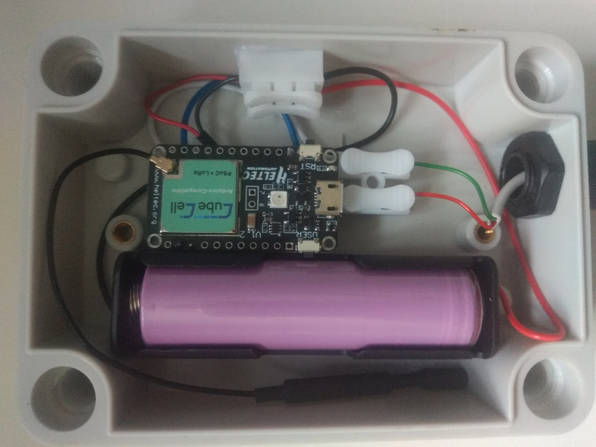
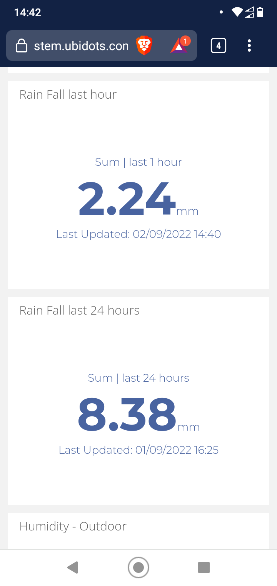
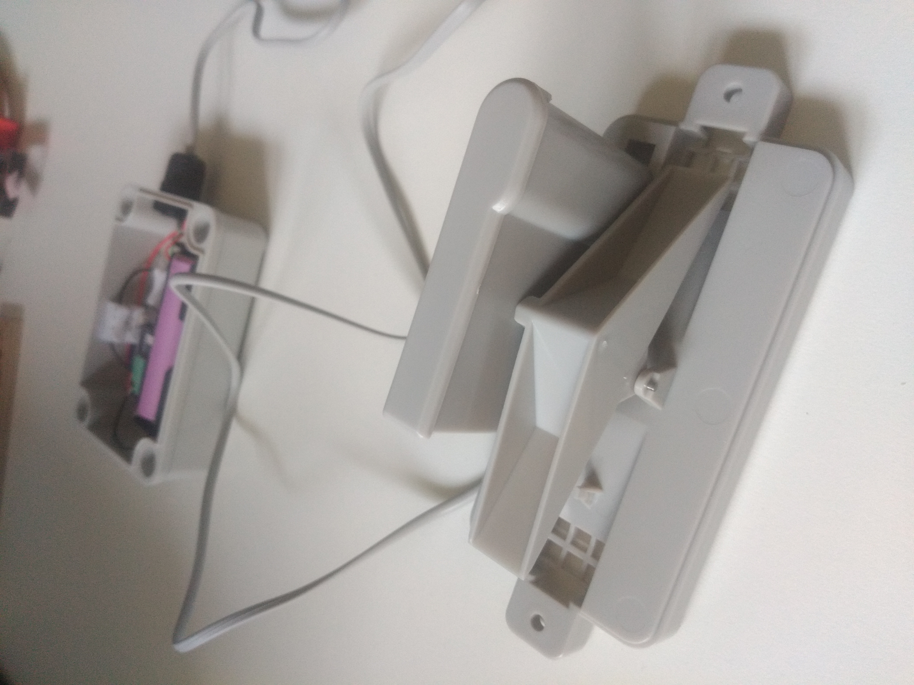

# Helium LoRaWAN Rain Gauge

This DIY project is a LoRaWAN Rain Gauge based on CubeCell HTCC AB01 development Board.

- [Helium LoRaWAN Rain Gauge](#helium-lorawan-rain-gauge)
  - [Prerequisites](#prerequisites)
  - [Hardware](#hardware)
  - [Software](#software)
  - [Uplink Cayenne LPP](#uplink-cayenne-lpp)
    - [Rainfall Counter](#rainfall-counter)
    - [Battery Voltage](#battery-voltage)
  - [Downlink](#downlink)
  - [Function Decoder](#function-decoder)
  - [Ubidots Integration](#ubidots-integration)
  - [Tipping bucket mechanism](#tipping-bucket-mechanism)


## Prerequisites

Crafting your own rain gauge, you will require: 
- [CubeCell HTCC AB01](https://heltec.org/project/htcc-ab01/) based on ASR605x chipset and LoRa SX1262 chip, support LoRaWAN 1.0.2 protocol and consumes only **3.5 uA** in deep sleep.
- A [rain gauge](https://www.aliexpress.com/item/2026877912.html) based on a tipping bucket which activates a magnetic reed switch each time the full bucket toggles.    
- Battery 18650-30Q 3000 mAh (3.7-4.2 Volts)
- Shield battery 18650
- Waterproof electrical box

## Hardware

First, connect one wire from the rain gauge to the **GPIO1** and last one to one of free **GND** pin from the dev board.
Connect the plus pole from the battery to the **VIN** pin of the board and the minus to the **GND** pin aside the **VIN** pin.



## Software

One of the two interrupts is defined on the **GPIO1**, each time the reed switch is activated by the tipping bucket, the module wakes up and increments a counter.   
The other interrupt is defined by the LoraWAN cycle (15 minutes by default) which sends data if the counter is higher than zero since the last sending.

In order to verify that the module is still alive, the program sends a daily **health check** message only if no data have been sent for the last 24 hours.  
An [alert](https://docs.helium.com/use-the-network/console/alerts/) is triggered by the Helium Console if the device has not sent any data for the last 24 hours.

## Uplink Cayenne LPP

###  <a name='RainfallCounter'></a>Rainfall Counter

- Data Channel : **15**
- Data Type : **0x00**

###  <a name='BatteryVoltage'></a>Battery Voltage

- Data Channel : **8**
- Data Type : **0x02**

## Downlink

By default, the module tries to send data every 15 minutes. This interval is configurable via [LoRaWAN downlink](https://docs.helium.com/use-the-network/console/integrations/http) .
Set the interval in hours, minutes, or both. Values are submitted in two separate buckets, [hours] and [minutes].
Values up to 255 are supported in each bucket. Use a tool like https://v2.cryptii.com/decimal/base64 to convert the two values into base64 before submitting them as a downlink in Helium Console on **Fport 1**. e.g.
```
"00 10" converts to "AAo=", representing 0 hrs, 10 min
```

## Function Decoder

Below a function decoder for [Ubidots](https://stem.ubidots.com) integration usable from Helium Console.     

> The function converts the [rainfall counter](#rainfall-counter) in millimeter. The gauge measures 0.2794 mm or 0.011".  


``` javascript
function Decoder(bytes, port, uplink_info)  {
  var decoded = {};
  var hexString = bin2HexStr(bytes);
  return rakSensorDataDecode(hexString, uplink_info);
}

// convert array of bytes to hex string.
// e.g: 026700f00768750673275a0c650053080201b9
function bin2HexStr(bytesArr) {
  var str = "";
  for (var i = 0; i < bytesArr.length; i++) {
    var tmp = (bytesArr[i] & 0xff).toString(16);
    if (tmp.length == 1) {
      tmp = "0" + tmp;
    }
    str += tmp;
  }
  return str;
}

// convert string to short integer
function parseShort(str, base) {
  var n = parseInt(str, base);
  return (n << 16) >> 16;
}

// convert string to triple bytes integer
function parseTriple(str, base) {
  var n = parseInt(str, base);
  return (n << 8) >> 8;
}

// decode Hex sensor string data to object
function rakSensorDataDecode(hexStr, uplink_info) {
  // Default timestamp
  var timestamp = Date.now();
  if (uplink_info) {
    timestamp = uplink_info.reported_at; // Timestamp reported by the Helium router
  }
  var str = hexStr;
  var data = {};
  var context = {};
  context.uplink_fcnt = uplink_info.fcnt;
  
  while (str.length > 4) {
    var flag = parseInt(str.substring(0, 4), 16);
    switch (flag) {
      case 0x0802:// Battery Voltage
        var voltage = {};
        voltage.value = parseFloat((parseShort(str.substring(4, 8), 16) * 0.01).toFixed(2)); // Unit: Volts
        voltage.timestamp =  timestamp;
        voltage.context =  context;           
        data.battery = voltage;
        str = str.substring(8);
        break;
      case 0x0f00:// Rainfall
        var rainfall= {};
        rainfall.value = parseInt(str.substring(4, 6), 16) * 0.2794 ; // Unit: mm
        rainfall.timestamp =  timestamp;
        context.rain_gauge = parseInt(str.substring(4, 6), 16);
        rainfall.context =  context;           
        data.rainfall = rainfall;
        str = str.substring(6);
        break;          
      default:
        str = str.substring(7);
        break;
    }
  }
  return data;
}
```
## Ubidots Integration


  
## Tipping bucket mechanism

